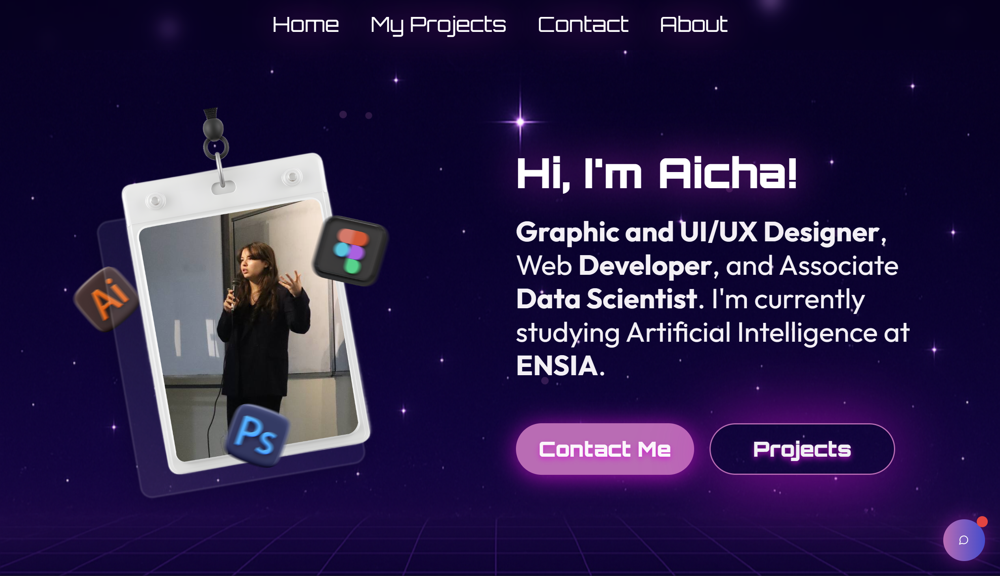

# Aicha Brihmouche - Portfolio

    

> **Multidisciplinary Creative & Developer** | Graphic Designer • UI/UX Designer • Web Developer • Associate Data Scientist

Welcome to my digital universe! I'm Aicha, a passionate creative professional currently pursuing Artificial Intelligence at ENSIA. This portfolio showcases my journey across design, development, and data science - where creativity meets code and innovation drives every project.

## 🌟 Main Features

- **Visual Design**: Immersive cosmic theme with dreamy animations and modern UI/UX
- **AI-Powered Experience**: Intelligent chatbot assistant that knows everything about my work
- **Flawless Responsiveness**: Seamless experience across all devices and screen sizes
- **Lightning Performance**: Optimized with lazy loading, error boundaries, and modern React patterns
- **Accessibility First**: Built with ARIA standards and keyboard navigation support
- **SEO Optimized**: Complete meta tags, sitemap, and search engine optimization

## 🚀 Technologies Used

- **Frontend**: React 18, TypeScript, Tailwind CSS
- **UI Components**: shadcn/ui, Radix UI
- **Animations**: Framer Motion
- **Icons**: Lucide React
- **Build Tool**: Vite
- **Styling**: Tailwind CSS with custom themes

### AI Assistant
- **Intelligent Chatbot**: Ask about my skills, projects, or experience - It'll respond instantly!
- **Context-Aware**: Understands your questions about hackathons, technologies, and career journey
- **Always Available**: 24/7 virtual assistant ready to showcase my capabilities

### Professional Highlights
- **Full-Stack Expertise**: From pixel-perfect designs to robust backend systems
- **Data Science Projects**: Machine learning models, statistical analysis, and predictive modeling
- **Design**: UI/UX work that balances aesthetics with functionality

**Performance & Quality**
- Vite for lightning-fast builds
- ESLint + TypeScript for code quality
- Error boundaries for graceful failure handling
- Lazy loading for optimal performance

**AI & Integration**
- Advanced conversation AI for chatbot functionality
- EmailJS for seamless contact form integration
- Responsive design patterns for all devices

## 📬 Let's Connect

- **Email**: aichabrihmouche@gmail.com
- **LinkedIn**: [linkedin.com/in/aicha-brihmouche]([https://www.linkedin.com/in/aicha-brihmouche](https://www.linkedin.com/in/aicha-brihmouche-a51730300/))
- **GitHub**: [github.com/peppa234](https://github.com/peppa234)
